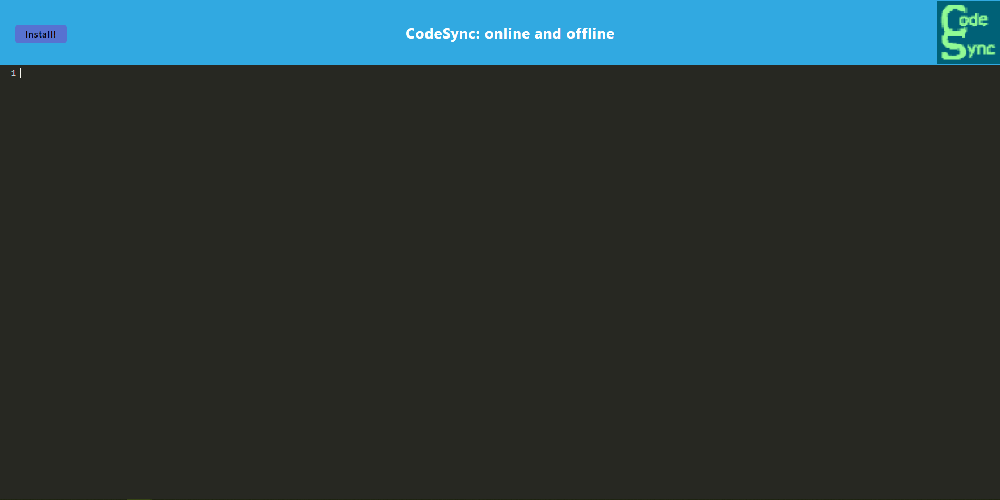

# CodeSync
  - An online or offline text editor for notes or code snipets.

## Description
- An online or offline text editor for notes or code snipets.
- I hoped to complete an online or offline text editor for my notes with this application.
- This application lets you retrieve your notes for later use, even without a wifi connection.

## Table of Contents
- [Installation](#installation)
- [Usage](#usage)
- [Feature(s)](#features)
- [License](#license)
- [Questions](#questions)

## Installation
You will be able to pull up the application within a provided URL.

## Usage

After pulling up your application, you can intall the webpage for an offline experience. 

## License

This project is licensed under the [None](https://opensource.org/licenses/None) License - see the [LICENSE](LICENSE) file for details.

## Feature(s)
- content typed onto the editor will be haved within the database letting you reopen with previous information  - You will be able to install the application onto your desktop. 

## Credits
- [Start Code](https://github.com/coding-boot-camp/cautious-meme)  
- [Render Deployment Guide](https://coding-boot-camp.github.io/full-stack/render/render-deployment-guide)
- [mdn web_docs  -  manifest.json](https://developer.mozilla.org/en-US/docs/Mozilla/Add-ons/WebExtensions/manifest.json)  
- [webpack configuration](https://webpack.js.org/configuration/)
- [mdn web_docs - service worker api](https://developer.mozilla.org/en-US/docs/Web/API/Service_Worker_API)

## Deployment
- [GitHub Repository](https://github.com/Develepor-Dan/CodeSync)
- [Deployed Application](https://codesync-roxv.onrender.com)

## Questions
For questions and contributions to the project, please contact [Daniel Zavala](mailto:zavaladaniel151@gmail.com).